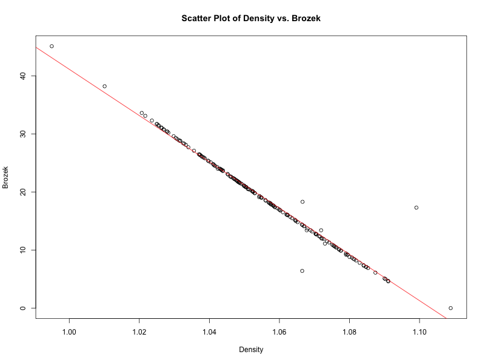

# Predicting Body Fat Percentage: Regression Models and Analysis

This project focuses on predicting body fat percentage from various physiological measurements using regression models. We explore the complexities of estimating body fat percentages with a comprehensive analysis of multiple regression techniques. The study includes data preparation, exploratory data analysis, model development, and thorough evaluation methodologies.

## Table of Contents

- [Introduction](#introduction)
- [Data Description](#data-description)
- [Installation](#installation)
- [Exploratory Data Analysis](#exploratory-data-analysis)
- [Methods](#methods)
  - [Model Development](#model-development)
  - [Model Comparison and Validation](#model-comparison-and-validation)
  - [Reporting and Visualization](#reporting-and-visualization)
- [Results](#results)
- [Findings](#findings)
- [Conclusion](#conclusion)
- [References](#references)

## Introduction

This study explores the complexities of predicting body fat percentage from various physiological measurements contained within the fat.csv dataset. The research encompasses a comprehensive analysis of multiple regression techniques, aiming to identify the most accurate models for estimating body fat percentages. The paper discusses the data preparation, exploratory data analysis, model development, and evaluation methodologies in detail.

## Data Description

The dataset, `fat.csv`, contains a diverse array of physiological and body composition measurements from 252 individuals. It includes variables such as body fat percentage, body density, age, weight, height, and various circumferences (neck, chest, abdomen, hip, thigh, knee, ankle, biceps, forearm, and wrist). This dataset presents a wide demographic range, with ages from 22 to 81 years and weights from 118.5 to 363.15 pounds, illustrating the broad spectrum of body sizes and compositions covered.

Variable Details:
- **BodyFat**: Body fat percentage.
- **Density**: Body density.
- **Age**: Age of the individual.
- **Weight**: Weight in pounds.
- **Height**: Height in inches.
- **Neck**: Neck circumference in inches.
- **Chest**: Chest circumference in inches.
- **Abdomen**: Abdomen circumference in inches.
- **Hip**: Hip circumference in inches.
- **Thigh**: Thigh circumference in inches.
- **Knee**: Knee circumference in inches.
- **Ankle**: Ankle circumference in inches.
- **Biceps**: Biceps circumference in inches.
- **Forearm**: Forearm circumference in inches.
- **Wrist**: Wrist circumference in inches.

## Installation

To replicate this analysis:

1. Clone the repository:
   ```bash
   git clone https://github.com/pclaridy/body-fat-prediction.git
   cd body-fat-prediction
2. Install the required R packages. You can do this by running the following command in R:

   ```R
   install.packages(c("arxiv", "ggplot2", "dplyr", "glmnet", "pls", "leaps"))
3. Open and run the R script `code.R` in your R environment

## Exploratory Data Analysis (continued)

### Detailed Analysis of Predictors

In my exploratory data analysis, I examined the relationships between significant predictors (`Siri`, `Density`, and `Biceps`) and the `Brozek` formula for body fat percentage through scatter plots, residual plots, Q-Q plots, and histograms. These analyses were crucial for validating the assumptions of linear regression models and provided in-depth insights into the predictors' behaviors.

#### Scatter Plots

The scatter plots provided the first glance at the relationships between each significant predictor and body fat percentage.

- **Scatter Plot of Siri vs. Brozek**: This plot revealed a strong linear relationship between `Siri` and `Brozek`, indicating that `Siri` is a highly predictive variable for body fat percentage. The regression line, depicted in red, closely followed the data points, showcasing the accuracy of the linear model in capturing this relationship.
  
- **Scatter Plot of Density vs. Brozek**: Similarly, the scatter plot for `Density` displayed a strong linear correlation with `Brozek`, with data points tightly clustered around the regression line. This highlights `Density` as another crucial predictor in estimating body fat percentage.
  
- **Scatter Plot of Biceps vs. Brozek**: The relationship between `Biceps` circumference and `Brozek` showed a linear trend but with more variability around the regression line compared to `Siri` and `Density`. This suggests that while `Biceps` circumference is significant, it may not be as strong a predictor as `Siri` or `Density`.





#### Residual Plots

The residual plots for each significant predictor demonstrated the spread of residuals and were instrumental in assessing homoscedasticity.

- **Residual Plot for Siri**: Showed a fairly even distribution of residuals around the zero line, indicating homoscedasticity and a well-fitted model for `Siri`.
  
- **Residual Plot for Density**: Demonstrated an even spread of residuals, reinforcing the accuracy of the model for `Density`.
  
- **Residual Plot for Biceps**: Revealed more spread in residuals, suggesting potential heteroscedasticity and indicating a less perfect fit for `Biceps`.


#### Q-Q Plots

The Q-Q plots assessed the normality of the residuals' distribution.

- **Q-Q Plot for Siri** and **Density**: Both plots indicated normally distributed errors, with minor deviations.
  
- **Q-Q Plot for Biceps**: Showed greater deviation from normality, suggesting the need for further investigation.


#### Histograms of Residuals

- **Histogram of Residuals for Siri** and **Density**: Displayed nearly normal distributions.
  
- **Histogram of Residuals for Biceps**: Showed an irregular distribution, indicating a complex relationship with body fat percentage.


## Methods

### Model Development

I developed several regression models to predict body fat percentage, each with a different approach to handling the predictors and the structure of the data:
- **Full Linear Model**: Incorporates all available predictors.
- **Best Subset Linear Model**: Identifies the most significant variables for prediction.
- **Stepwise Regression Using AIC**: Adds or removes predictors based on the Akaike Information Criterion.
- **Ridge Regression**: Applies regularization to reduce multicollinearity among predictors.
- **LASSO Regression**: Performs variable selection by shrinking coefficients of less significant variables to zero.
- **Principal Component Regression (PCR)**: Reduces predictors to uncorrelated components.
- **Partial Least Squares (PLS)**: Finds multidimensional variance directions that explain the response variable.

### Model Comparison and Validation

Each model underwent a rigorous validation process, using Mean Squared Error (MSE) for performance assessment and Monte Carlo cross-validation to ensure model stability. Hyperparameter tuning was performed for models requiring it, such as ridge and LASSO regression.

### Reporting and Visualization

I reported and visualized my findings through tables and plots, comparing the MSE values of each model and summarizing the performance metrics to guide the choice of the best-performing model.

## Results

My analysis detailed the MSE for individual models and the average MSE after conducting Monte Carlo simulations. The models exhibited varying levels of accuracy, with the Best Subset Model and LASSO Regression showing particularly low MSEs, indicating high predictive accuracy. The MSE comparison tables are below:

- MSE values table: `mse_table.png`
- Average MSE values table: `avg_mse_table.png`

## Findings

My comprehensive model comparison revealed that the Stepwise Model has the lowest MSE, making it the best-performing model for predicting body fat percentage. Additionally, the Best Subset Model displayed the lowest average MSE in Monte Carlo simulations, further emphasizing its efficacy.

## Conclusion

This project highlighted the effectiveness of various regression techniques in predicting body fat percentage from physiological measurements. The Stepwise Model, based on the lowest MSE, and the Best Subset Model, with the lowest average MSE from Monte Carlo simulations, emerged as the most accurate models.

## References

- [R documentation](https://www.r-project.org/other-docs.html)
- [ggplot2: Elegant Graphics for Data Analysis](https://ggplot2.tidyverse.org)
- [glmnet: Lasso and Elastic-Net Regularized Generalized Linear Models](https://cran.r-project.org/web/packages/glmnet/index.html)
- [pls: Partial Least Squares and Principal Component regression](https://cran.r-project.org/web/packages/pls/index.html)
